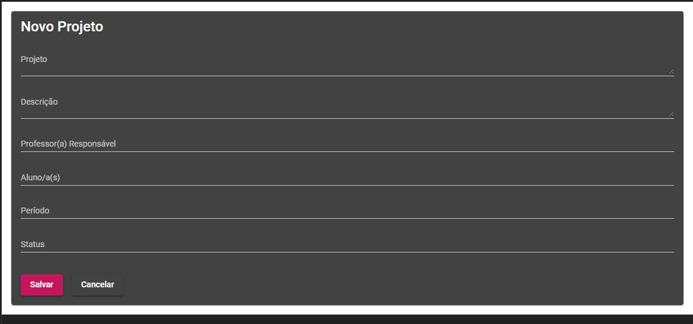
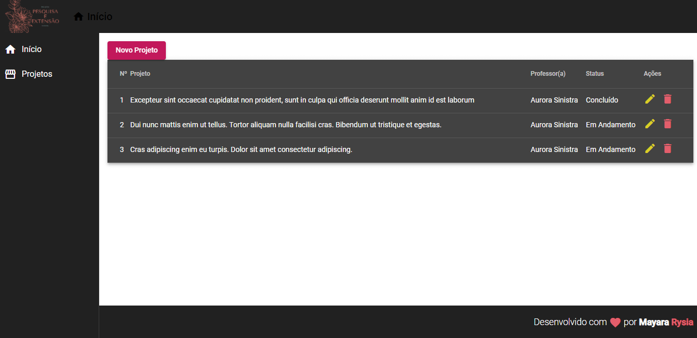
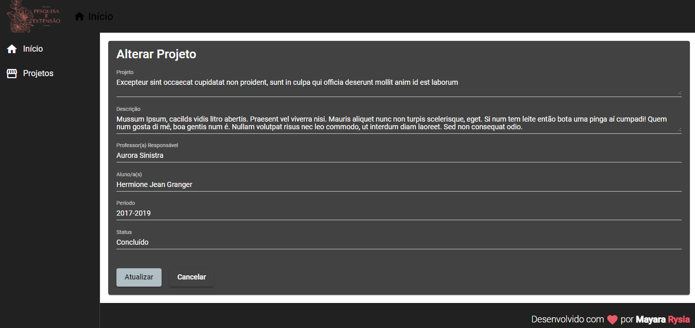
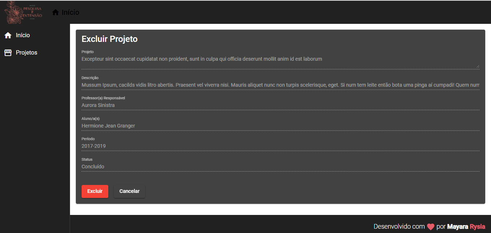

# FrontendProjectsCinfo

- This project was generated with [Angular CLI](https://github.com/angular/angular-cli) version 10.1.3.

-  frontend project for the discipline of Introduction to Web Technologies - BSI IFAL

- **This project is a CRUD**

- * The heroku branch contains data that may be out of date. If you are a student of the course and are interested in a project, look for the responsible teacher to check the status of the project.

## [CLOUD DEPLOYMENT](https://frontend-projects-cinfo.herokuapp.com/)

## Backend Server

* [json server here](https://github.com/mayararysia/backend-projects-cinfo)

## Development server

Run `ng serve` for a dev server. Navigate to `http://localhost:4200/`. The app will automatically reload if you change any of the source files.

## Screens

